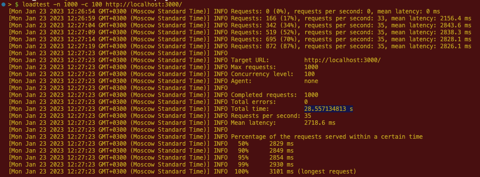

# cluster

NodeJS Cluster

1. Create one instance of app (express server) for each CPU
2. Using npm loadtest define total time of 1000 requests with concurrency 100
3. Compare result if we create only one instance

## Result with one instance (server)

## Result with clusters (one server for each CPU)

